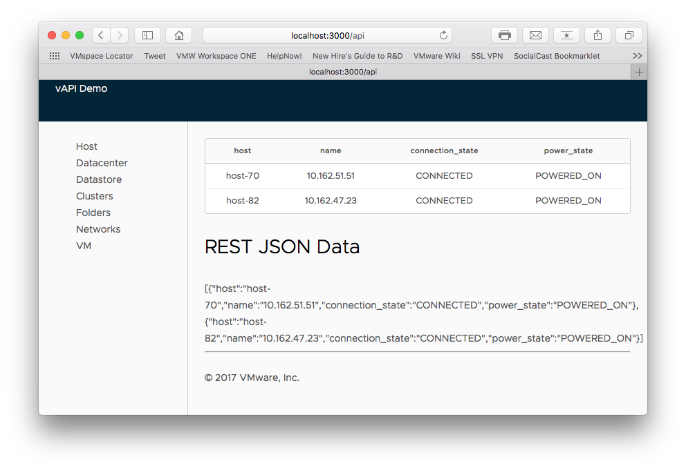

# vSphere REST API Sample Web Application
*Originally presented at VMworld 2017 in session SER1912BU [VMware Open-Source SDKs: From Getting Started to Web App in One Hour](https://www.youtube.com/watch?v=k1u--w95I1k)*

Basic [nodejs](https://nodejs.org/) [Express](https://expressjs.com/) web application illustrating connecting to the vSphere REST API endpoint using JavaScript.

**NOTE:** This app is for **demonstration purposes only** and should NOT be used against your production vSphere environment until/unless you have thoroughly reviewed/modified the code specifically for your environment.

## Screenshot

## How it works
This simple two-page web application illustrates how to authenticate to the vSphere REST API endpoint and make subsequent calls and render information from a vCenter server instance. The home page is a login page and upon successful authentication displays an inventory (/inventory) page which renders the results of an vSphere REST API call. By default the application displays a list of the hosts from the [/rest/vcenter/host](https://code.vmware.com/apis/191/vsphere-automation#/doc/operations/com/vmware/vcenter/host.list-operation.html) API. The inventory page also accepts a "path" query parameter to call other API's (ex. /?path=/rest/vcenter/datastore). The application as written only supports HTTP GET calls to the REST API meaning it's read-only.

## Requirements
NodeJS

Additional npm packages used in this example:

    "dependencies": {
        "express": "^4.13.4",
        "clarity-ui": "^0.10.0",
        "pug": "^2.0.0-rc.3",
        "request": "^2.72.0",
        "body-parser": "^1.15.1",
        "dotenv": "^2.0.0"
    },

## Install

    $ git clone https://github.com/vmware/vsphere-automation-sdk-rest.git
    $ cd vsphere-automation-sdk-rest/samples/javascript/web/inventory
    $ npm install

## Setup
Edit the file ".env" and set your HOST, USERID and PASS vars to point to your vSphere **staging** host. By default the .env file is configured to use a mock infrastructure provided by Wiremock, see below.

    $ npm start

Or

    $ node app.js

### Using mock infrastructure
Included with this repo are a set of Wiremock files allowing you to mock the vSphere REST API and run the sample. You'll need to [download wiremock](http://wiremock.org/) and run it as follows:

    java -jar wiremock-standalone-2.5.0.jar --https-port=8082 --verbose --root-dir <path-to-repo-wiremock-folder>

Example:

    java -jar ~/Downloads/wiremock/wiremock-standalone-2.5.0.jar --https-port=8082 --verbose --root-dir ~/github/vapi-express/wiremock

## Using Clarity CSS
The app includes a base template to render the site using the CSS from [VMware's Clarity Design System](https://clarity.design) however it is not a full clarity-seed application and does not require Angular.
