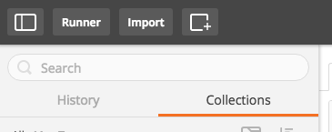
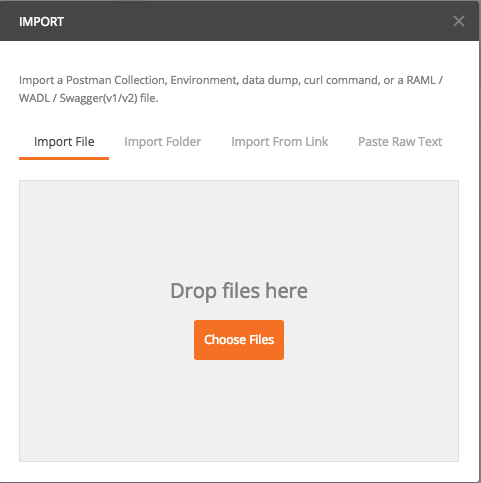
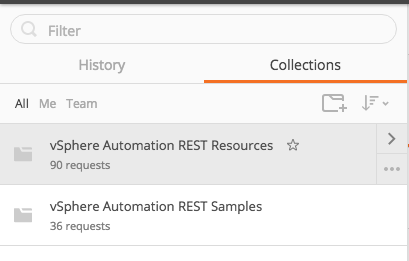
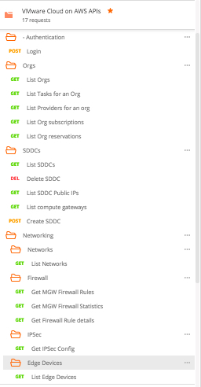

# vSphere and VMware Cloud on AWS API Postman Resources and Samples

These three files provide API resources and example end to end scenarios that you
can import in to Postman to execute.

* [vSphere-Automation-REST-Resources.postman_collection.json](vSphere-Automation-REST-Resources.postman_collection.json) provides the
individual API resources. They are standalone requests that you can execute or use to build up an end to end workflow.
* The [vSphere-Automation-Rest-API-Samples.postman.json](vSphere-Automation-Rest-API-Samples.postman.json) do
exactly that to show some common simple use cases.
* The [vSphere-Automation-Rest-API-Appliance-Resources.postman.json](vSphere-Automation-Rest-API-Appliance-Resources.postman.json)
provides individual API resources to manage vCenter Server Appliance. They are standalone requests that you can execute
or use to build up an end to end workflow.
* The [vSphere-Automation-REST-resources-for-Content-Library.postman_collection.json](vSphere-Automation-REST-resources-for-Content-Library.postman_collection.json)
provides individual API resources to manage vCenter Content Library features. They are standalone requests that you can execute
or use to build up an end to end workflow.
* The [VMware Cloud on AWS APIs.postman_collection.json](VMware%20Cloud%20on%20AWS%20APIs.postman_collection.json)
provides individual API resources to manage VMware Cloud on AWS features. They are standalone requests that you can execute
or use to build up an end to end workflow.

## Requirements
[Postman Client](https://www.getpostman.com)

## Installation

The included .json files were built using the Postman client. It is recommended that you install the latest client from [Postman](https://www.getpostman.com).

Once installed, start Postman, and select the import button in the upper left corner:

You will see the import dialog open:

You can drag and drop the JSON files in this directory one at a time on to the
dialog area where is says Drop files here or you can select the Choose files
button to open a file chooser dialog and navigate to the location on your system
where this directory resides, and select the JSON files.

The JSON files include both the API collections and also a default "Environment" that can be altered so that each of the API collections works against your own environment.

Once imported, you will see something similar to:

Firstly you will need to adjust the imported environment to work with your vCenter Server, to do this click the eye icon near the top right and click the "edit" button to edit the "My vCenter" environment.  Replace the values for each item to reflect the test vCenter you will be working with.  As a minimum for most samples to work you will need to alter details for VC, User and password providing SSO credentials here.

From here, you can expand either the resources to see the individual API surfaces
or expand the samples and see some of the ways you can string together the
individual resources to make a use case.

Content Library samples:

VMware Cloud on AWS samples:

To work with the VMware Cloud on AWS Samples follow these steps:
1. Import the sample file from this repository into Postman
2. Import the VMC Environment sample from this repository into Postman
3. From the VMC Console click your name at the top right of the console window, click "OAuth Refresh Token", from this page, generate or copy your refresh token.
4. Edit the "VMC Environment" in Postman and set the refresh_token value to the previously copied item.
5. Use the samples starting with Authentication - Login action.
* The Org and SDDC will be automatically stored as environmental variables for future API calls once the samples are run, see the Tests tab for how this is done on each call.
